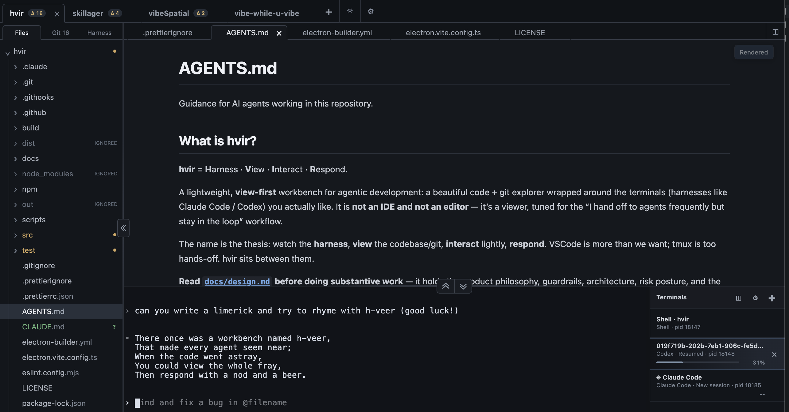

# hvir (H-veer)

**H**arness · **V**iew · **I**nteract · **R**espond

A lightweight, view-first workbench for agentic development: a polished code and Git
explorer wrapped around the terminals where Claude Code, Codex, and your shell do the
work.



## Why hvir?

hvir is not an IDE and not an editor. It serves one workflow: _“I hand work to agents
frequently, but I want to stay in the loop.”_ tmux is too hands-off for exploring a
codebase and its history; a full IDE is more than this workflow needs. hvir sits between
them.

- Local and SSH projects are peers, with discovered Git worktrees as warm workspaces.
- Files, rendered Markdown, source, diffs, blame, Changes, History, and the commit graph
  are first-class viewing surfaces.
- Existing clean local branches can be explored from a bounded branch selector; advanced
  Git operations stay in the terminal.
- Multiple shell, Claude Code, and Codex sessions split, recover, resume, and report
  attention without a daemon.
- Compact tabs and floating Rendered/Source/Diff controls keep the viewer focused on
  content instead of chrome.
- Dark/light themes, viewer and terminal splits, three-state pane controls, and
  configurable core shortcuts keep the workbench fluid.
- Heavy filesystem, Git, rendering, watching, and telemetry work stays off the render
  thread.

## Install

Install hvir from npm, then launch it from any directory:

```sh
npm install -g hvir-workbench
hvir
```

Pass a local project folder to open it directly (`hvir .`). The npm launcher supports
Linux x64, Linux arm64, and Apple-silicon macOS. Native installers are deliberately not
another supported release path; see [docs/packaging.md](docs/packaging.md).

hvir expects the system `git` binary. Claude Code and Codex launch options use those CLIs
from the selected host's login-shell environment; plain shells work without either.

## Feedback and project tracking

Public questions and problem reports belong in the
[Q&A Discussions](https://github.com/jarmak-personal/hvir/discussions/categories/q-a), while
proposals belong in [Ideas](https://github.com/jarmak-personal/hvir/discussions/categories/ideas).
GitHub Issues remain the canonical maintainer planning tracker. New, reopened, or unlocked
issue and pull-request conversations are locked automatically; repository collaborators can
still comment for the create, review, and feedback workflow.

Conversation locking does not make an external pull-request title or body trusted input. Agent
workflows should continue to use the trust-boundary guidance in [CONTRIBUTING.md](CONTRIBUTING.md).

## Development

Node 24 is used by release CI.

Start with the [contributor guide](CONTRIBUTING.md). Substantive implementation is discussed in
a governing issue before code or a pull request; the repository also includes optional,
contributor-only agent skills for creating and implementing issues.

```sh
npm ci
npm run verify
npm run smoke
npm run dev
```

`npm ci` downloads Electron and rebuilds native dependencies for Electron's ABI. On a
headless Linux machine, run the Electron smoke under `xvfb-run`. The full Phase 8 release
check is:

```sh
npm run gauntlet
```

Contributors can opt into the repository's pre-push hook:

```sh
npm run hooks:install
```

The hook runs `npm run smoke` using the machine's installed Electron platform and
architecture. Headless Linux uses `xvfb-run` when available. The full gauntlet remains
the authoritative CI gate; use `git push --no-verify` when a deliberate local bypass is
needed.

Build the npm payload for the current supported platform with the matching
`pack:npm:*` script. See the
[performance gauntlet](docs/phase8-performance-gauntlet.md) and
[packaging guide](docs/packaging.md) for release acceptance.

## Project documents

| Document | Purpose |
| --- | --- |
| [Design and ADR index](docs/design.md) | Product philosophy, hard boundaries, architecture, and decision index |
| [Architecture decisions](docs/adr/README.md) | Canonical decision-only ADR records and template |
| [Historical implementation plan](docs/plan/00-overview.md) | Frozen early implementation context; active work lives in GitHub issues |
| [Contributor guide](CONTRIBUTING.md) | Issue-first workflow, architecture discipline, and verification |
| [AGENTS.md](AGENTS.md) | Repository rules for AI collaborators |
| [CLAUDE.md](CLAUDE.md) | Claude entrypoint for the shared repository instructions |

The deliberate boundary remains: hvir may surface rich read-only information and permit
a minor edit-and-save, but it does not grow into an IDE.
