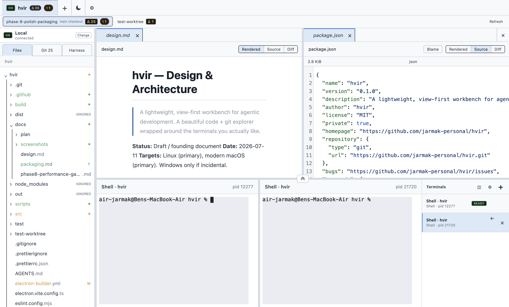

# hvir

**H**arness · **V**iew · **I**nteract · **R**espond

A lightweight, view-first workbench for agentic development: a polished code and Git
explorer wrapped around the terminals where Claude Code, Codex, and your shell do the
work.


## Why hvir?

hvir is not an IDE and not an editor. It serves one workflow: _“I hand work to agents
frequently, but I want to stay in the loop.”_ tmux is too hands-off for exploring a
codebase and its history; a full IDE is more than this workflow needs. hvir sits between
them.

- Local and SSH projects are peers, with discovered Git worktrees as warm workspaces.
- Files, rendered Markdown, source, diffs, blame, Changes, History, and the commit graph
  are first-class viewing surfaces.
- Existing clean local branches can be explored from a bounded branch selector; advanced
  Git operations stay in the terminal.
- Multiple shell, Claude Code, and Codex sessions split, recover, resume, and report
  attention without a daemon.
- Dark/light themes, viewer splits, terminal splits, configurable core shortcuts, and a
  one-click terminal-focus mode keep the workbench fluid.
- Heavy filesystem, Git, rendering, watching, and telemetry work stays off the render
  thread.



## Install

Tagged builds are produced as Linux AppImage/deb and macOS dmg/zip artifacts for Apple
Silicon and Intel. The v1 macOS artifacts are currently unsigned, so first launch on
another Mac requires explicit approval in **System Settings → Privacy & Security**.
Signing and notarization are documented in [docs/packaging.md](docs/packaging.md).

hvir expects the system `git` binary. Claude Code and Codex launch options use those CLIs
from the selected host's login-shell environment; plain shells work without either.

## Development

Node 24 is used by release CI.

```sh
npm ci
npm run verify
npm run smoke
npm run dev
```

`npm ci` downloads Electron and rebuilds native dependencies for Electron's ABI. On a
headless Linux machine, run the Electron smoke under `xvfb-run`. The full Phase 8 release
check is:

```sh
npm run gauntlet
```

Build native artifacts on their target operating system with `npm run dist:linux` or
`npm run dist:mac`. See the [performance gauntlet](docs/phase8-performance-gauntlet.md)
and [packaging guide](docs/packaging.md) for release acceptance.

## Project documents

| Document | Purpose |
| --- | --- |
| [Design and ADRs](docs/design.md) | Product philosophy, hard boundaries, architecture, and decisions |
| [Plan of Record](docs/plan/00-overview.md) | Phased implementation status and acceptance criteria |
| [AGENTS.md](AGENTS.md) | Repository rules for AI collaborators |

The deliberate boundary remains: hvir may surface rich read-only information and permit
a minor edit-and-save, but it does not grow into an IDE.
