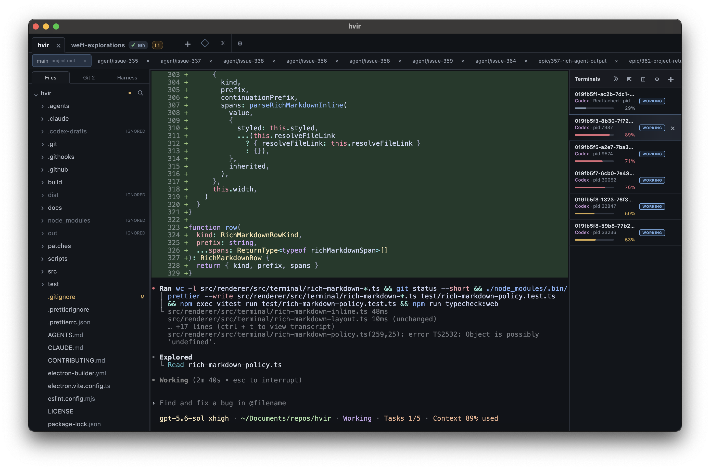
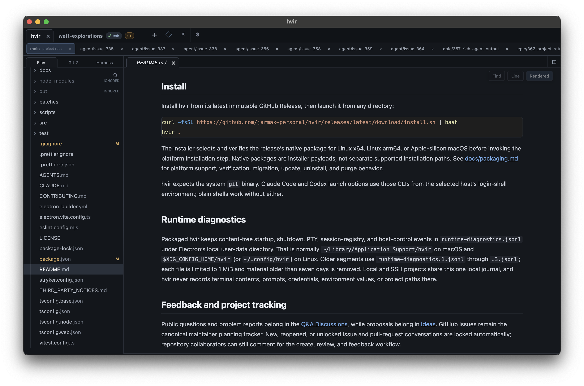
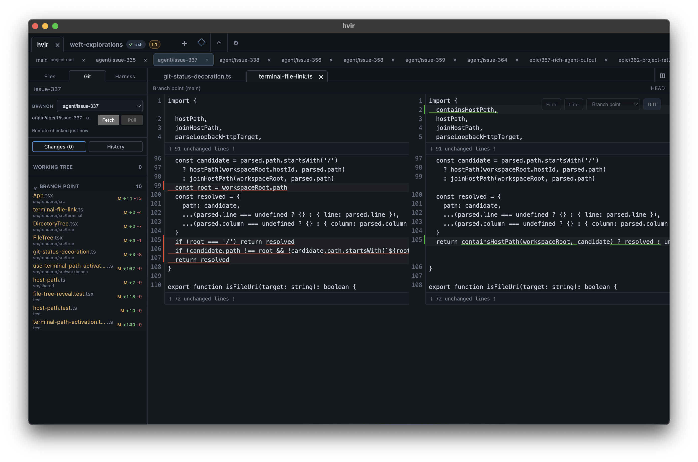

# hvir (H-veer)

**h**arness · **v**iew · **i**nteract · **r**espond

A lightweight, view-first workbench for agentic development: a polished code and Git
explorer wrapped around the terminals where Claude Code, Codex, and your shell do the
work.



## Why hvir?

hvir is not an IDE and not an editor. It serves one workflow: _“I hand work to agents
frequently, but I want to stay in the loop.”_ tmux is too hands-off for exploring a
codebase and its history; a full IDE is more than this workflow needs. hvir sits between
them.

- Local and SSH projects, with auto discovered Git worktrees as workspaces.
- View files, rendered Markdown, source, diffs, blame, changes, history, or the commit graph
- Multiple shell, Claude Code, and Codex sessions split, recover, resume, and report
  attention without a daemon.
- Small ui elements try to keep the viewer focused on content instead of chrome.
- Dark/light themes, viewer and terminal splits, three-state pane controls, and
  configurable core shortcuts.
- Lightweight is a feel: heavy filesystem, Git, watching, and telemetry work stays off the render
  thread.

## Install

Install hvir from its latest GitHub Release, then launch it from any directory:

```sh
curl -fsSL https://github.com/jarmak-personal/hvir/releases/latest/download/install.sh | bash
hvir .
```

The installer selects and verifies the release's native package for Linux x64, Linux arm64,
or Apple-silicon macOS before invoking the platform installation step.

hvir does expect the system `git` binary. Claude Code and Codex launch options use those CLIs
from the selected host's login-shell environment; plain shells work without either.

## One window, many views

The same workspace can move from reading to review to a terminal-focused handoff without
turning the workbench into an IDE.

| | |
| --- | --- |
| **Rendered documentation** | **Branch-point diff** |
| [](docs/screenshots/rendered-markdown.png) | [](docs/screenshots/branch-point-diff.png) |
| [](docs/screenshots/terminal-focus.png) | [](docs/screenshots/live-html-viewer.png) |
| **Terminal focus** | **Live HTML beside the harness** |


## Feedback and contributions

hvir's maintainer-authored issue pipeline began as a security boundary: public text is untrusted
input to an agent. It is now also a deliberate contribution model. Public contribution ends with
defining worthwhile problems and outcomes through discussion; maintainers decide product fit and
readiness, author every canonical GitHub Issue, and own implementation. Outside issues and pull
requests are not accepted contribution paths, even if future tooling provides stronger
prompt-injection defenses.

Start in the Discussion category that best fits:

- [Bug reports](https://github.com/jarmak-personal/hvir/discussions/categories/bug-reports) for
  broken or incorrect hvir behavior.
- [Feature requests](https://github.com/jarmak-personal/hvir/discussions/categories/feature-requests)
  for a specific proposed product change.
- [Documentation](https://github.com/jarmak-personal/hvir/discussions/categories/documentation) for
  missing, incorrect, or unclear project documentation.
- [Q&A](https://github.com/jarmak-personal/hvir/discussions/categories/q-a) for usage and support
  questions.
- [General](https://github.com/jarmak-personal/hvir/discussions/categories/general) for workflows,
  show-and-tell, and other hvir-related conversation.

[Announcements](https://github.com/jarmak-personal/hvir/discussions/categories/announcements) is
the maintainer-to-user surface for updates and requests for feedback. GitHub Releases remains the
canonical release surface; an announcement may discuss or link to a release, but does not replace
it.

## Development

Development requires Node 24 or newer; release CI uses Node 24.

Start with the [contributor guide](CONTRIBUTING.md). It separates public product discussion from
the maintainer development workflow. Substantive implementation is aligned in a governing issue
before code or a pull request; the repository also includes optional, contributor-only agent
skills for creating and implementing issues.

```sh
npm ci
npm run verify
npm run smoke
npm run smoke:capacity
npm run performance:capacity  # controlled machine only
npm run dev
```

`npm ci` downloads Electron and rebuilds native dependencies for Electron's ABI. On a
headless Linux machine, run the Electron smoke under `xvfb-run`.
Raw `npm run dev` and unsigned `npm run build:dir` are not the macOS LAN SSH acceptance identity;
use the
[signed coexistence workflow](docs/macos-ssh-acceptance.md) for that boundary.

See the [performance gauntlet](docs/phase8-performance-gauntlet.md) and
[packaging guide](docs/packaging.md) for release acceptance.

## Project documents

| Document | Purpose |
| --- | --- |
| [Design and ADR index](docs/design.md) | Product philosophy, hard boundaries, architecture, and decision index |
| [Architecture decisions](docs/adr/README.md) | Canonical decision-only ADR records and template |
| [Historical implementation plan](docs/plan/00-overview.md) | Frozen early implementation context; active work lives in GitHub issues |
| [Contributor guide](CONTRIBUTING.md) | Issue-first workflow, architecture discipline, and verification |
| [GitHub project management](docs/project-management.md) | Canonical labels, normalized planning records, and Project automation commands |
| [AGENTS.md](AGENTS.md) | Repository rules for AI collaborators |
| [CLAUDE.md](CLAUDE.md) | Claude entrypoint for the shared repository instructions |

## License

hvir is available under the [MIT License](LICENSE). See
[Third-party notices](THIRD_PARTY_NOTICES.md) for software redistributed with hvir,
including the locally modified terminal runtime.
