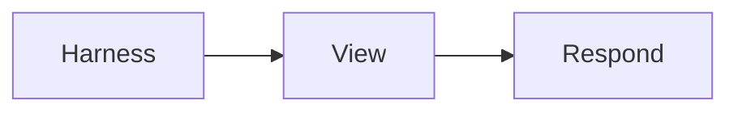

# Rendered fixture



```ts
const mode: 'rendered' | 'source' | 'diff' = 'rendered'
```

[Open the YAML fixture](rendered.yml)
[Missing target](missing.md)

Bare filenames such as design.md are prose, not internet hosts.
